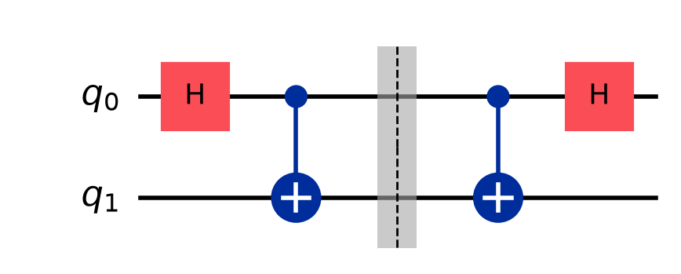

# Involutions

A gate is an **involution** when applying it twice reverts the result to the
initial input values:

$$\boxed{U^2 = I}$$

## Table of involution gates

| Gate | Qubits acted on | What it does |
| :--- | :-: | :--- |
| $X$ | 1 | swaps $\vert 0\rangle \leftrightarrow \vert 1\rangle$ |
| $Y$ (Pauli, with $-i$) | 1 | swaps with phases |
| $Z$ | 1 | sign flip on $\vert 1\rangle$ |
| $H$ | 1 | basis change; $H^2 = I$ |
| CNOT | 2 | flip target if control is 1 |
| SWAP | 2 | exchange the two qubits |
| Toffoli (CCNOT) | 3 | flip target if both controls are 1 |
| Fredkin (CSWAP) | 3 | swap targets if control is 1 |

> [!warning] Correction to the original note
> The handwritten table listed **CSWAP as acting on 2 qubits**. CSWAP *is* the
> Fredkin gate and acts on **3** qubits (1 control + 2 targets). The 2-qubit
> uncontrolled version is plain **SWAP**, listed above in its place.

## Example: the Bell circuit is its own inverse

At the barrier — halfway through, after $H$ then CNOT — the state is:

$$\tfrac{1}{\sqrt2}|00\rangle + \tfrac{1}{\sqrt2}|11\rangle$$

Running the same two gates again in reverse order returns the qubits to
$|0\rangle|0\rangle$.

This "un-preparing" step is exactly the
**reverse Bell circuit** used by Bob in [Superdense_Coding](../03_Protocols/Superdense_Coding.md) and by Alice in
[Quantum_Teleportation](../03_Protocols/Quantum_Teleportation.md).
