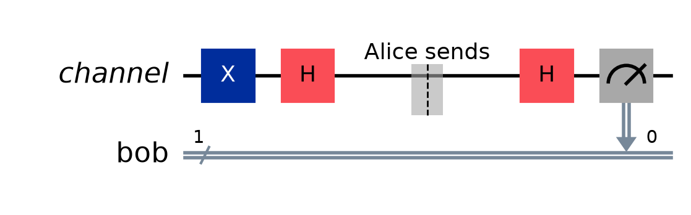
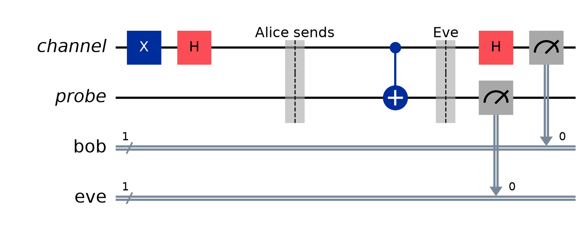

# BB84

The first quantum key distribution protocol — Bennett and Brassard, 1984. Runnable
version: [`bb84.py`](bb84.py).

BB84 does **not** encrypt anything, and it does not send a chosen message. It gives
Alice and Bob a shared string of random bits, and guarantees that if anyone
listened while they were building it, **they will find out**. That is the whole
product: not secrecy, but *detection*. A key nobody watched is kept; a key somebody
watched is thrown away before it is ever used.

## The two bases

Everything rests on two ways of encoding a bit into one qubit:

| Bit | $Z$ basis (rectilinear) | $X$ basis (diagonal) |
| :-: | :-: | :-: |
| 0 | $\vert 0\rangle$ | $\vert +\rangle = \tfrac{1}{\sqrt2}(\vert 0\rangle + \vert 1\rangle)$ |
| 1 | $\vert 1\rangle$ | $\vert -\rangle = \tfrac{1}{\sqrt2}(\vert 0\rangle - \vert 1\rangle)$ |

These bases are **conjugate**: every state of one is exactly halfway between the
states of the other. Concretely, for any $a \in \{|0\rangle, |1\rangle\}$ and any
$b \in \{|+\rangle, |-\rangle\}$,

$$\big|\langle a | b \rangle\big|^2 = \tfrac12$$

so measuring an $X$-basis state in the $Z$ basis returns a **coin flip**, and
destroys the state on the way. Measuring in the wrong basis is not a partial
answer, or a noisy answer. It is no answer at all, and it costs you the original.

That single sentence is the security of BB84. Everything below is bookkeeping
around it.

## The protocol

1. For each round, Alice picks a **random bit** and a **random basis**, and sends
   the matching state.
2. Bob picks his **own random basis** and measures. He has no idea which one Alice
   used.
3. **Sifting.** Over a public channel they announce their *bases* — never their
   bits — and discard every round where the bases disagreed. About half survive.
4. **Checking.** They sacrifice a random subset of the surviving bits and compare
   them openly. Those bits are now public and are discarded regardless.
5. If the error rate is low enough, the remaining bits are the key. If not, they
   abort and start over.



*One clean round: Alice sends $|-\rangle$ (an $X$-basis 1), Bob happens to choose
$X$ too, and reads 1 with certainty. The barriers mark where the qubit leaves Alice
and arrives at Bob.*

On rounds where the bases matched, Bob's Hadamard undoes Alice's and his result is
forced:

$$|1\rangle \xrightarrow{\;H\;} |-\rangle \xrightarrow{\;\text{channel}\;} |-\rangle \xrightarrow{\;H\;} |1\rangle$$

On rounds where they did not match, Bob's outcome is a coin flip, which is why
those rounds are thrown away rather than corrected.

## Why Eve cannot simply copy the qubit

The obvious attack is to keep a copy and forward the original. It is forbidden, and
the proof is three lines. Suppose some unitary $U$ cloned any state:
$U|\psi\rangle|0\rangle = |\psi\rangle|\psi\rangle$. Apply it to the basis states:

$$U|0\rangle|0\rangle = |00\rangle, \qquad U|1\rangle|0\rangle = |11\rangle$$

Now feed it $|+\rangle$. **Linearity** forces

$$U|+\rangle|0\rangle = \tfrac{1}{\sqrt2}\big(|00\rangle + |11\rangle\big)$$

but **cloning** demands

$$|+\rangle|+\rangle = \tfrac12\big(|00\rangle + |01\rangle + |10\rangle + |11\rangle\big)$$

These are different states — the first is entangled, the second is a product — so
no such $U$ exists. This is the **no-cloning theorem**, and note what did the work:
nothing but linearity, the same property that makes superposition possible at all.

So Eve cannot duplicate. She has to **measure**, and measuring means choosing a
basis without knowing Alice's.

## Intercept-resend, and the 25%

Eve's simplest real attack: measure each qubit in a basis she guesses, then send on
whatever she found. Take a round where Alice and Bob happened to agree — the only
rounds that survive sifting — and count:

| Eve's basis | Probability | What she learns | What Bob then sees |
| :--- | :-: | :--- | :--- |
| matches Alice's | $\tfrac12$ | the bit, exactly | the right bit, always |
| differs | $\tfrac12$ | a coin flip | a coin flip: **wrong half the time** |



*Eve guesses $Z$ against Alice's $X$. Her `probe` walks off with a copy of the
wrong observable, and the `channel` qubit that reaches Bob has been collapsed onto
an axis it was never on.*

So the error rate Alice and Bob measure on their sifted bits is

$$\text{QBER} = \underbrace{\tfrac12}_{\text{Eve guessed wrong}} \times \underbrace{\tfrac12}_{\text{Bob then errs}} = \tfrac14$$

A quarter of the bits that were supposed to agree do not. Eve pays for every bit
she reads, and she cannot choose to pay less: not measuring means learning nothing.

Each compared bit is an independent $\tfrac34$ chance of her slipping past, so
detection is quick:

| Bits compared | Eve escapes with probability |
| :-: | :-: |
| 10 | 5.6% |
| 50 | $5.7 \times 10^{-7}$ |
| 126 | $1.8 \times 10^{-16}$ |
| 1029 | $2.7 \times 10^{-129}$ |

## What Eve gets for the trouble

She guesses Alice's basis half the time and reads those bits perfectly. On the
other half she holds a coin flip, which is right by luck half the time:

$$P(\text{Eve correct}) = \tfrac12 \cdot 1 + \tfrac12 \cdot \tfrac12 = \tfrac34$$

The script confirms it — 75.0% of the surviving key, against 50% for guessing. So
an undetected Eve would be a catastrophe. The protocol's answer is not to make her
attack fail, but to make it **loud**.

## The 11% threshold

Why abort at 11% rather than at any error at all? Because a real channel is noisy,
and Alice and Bob cannot tell noise from eavesdropping — so they must assume the
worst and ask how much key survives it. Under the Shor–Preskill security proof, the
fraction of secret key extractable from raw bits at error rate $Q$ is

$$r = 1 - 2h(Q), \qquad h(Q) = -Q\log_2 Q - (1-Q)\log_2(1-Q)$$

One $h(Q)$ pays for error correction — repairing Bob's copy — and the other pays
for privacy amplification, shrinking the key until what Eve knows about it is
negligible. The key rate hits zero when $h(Q) = \tfrac12$, and

$$h(0.11) = 0.4999\ldots$$

so $Q \approx 11\%$ is where there is nothing left to extract. Intercept-resend
produces 25%, well past it. The gap between the two is the room a noisy device has
to work in.

## How this implementation models Eve

The circuit does not measure the qubit in flight. Eve **copies it onto a probe she
keeps**, in her own basis, and the probe is measured at the end along with
everything else:

$$\text{if } e = X:\; H \quad\to\quad \text{CNOT}(\text{channel} \to \text{probe}) \quad\to\quad \text{if } e = X:\; H$$

By the **principle of deferred measurement**, a mid-circuit measurement whose result
nothing later depends on gives exactly the same statistics as entangling with a
fresh qubit and measuring it at the end. So this is the same attack, and it has
three practical advantages: it needs no dynamic circuits, it runs on any backend,
and Qiskit's `StatevectorSampler` will simulate it (it refuses mid-circuit
measurements outright).

It is also the *stronger* attacker. Eve keeping a quantum memory and deciding later
what to do with it is more powerful than Eve committing to an answer immediately —
and BB84 survives her anyway.

## Running it

```bash
uv run python 03_Protocols/bb84.py
uv run python 03_Protocols/bb84.py --eve
uv run python 03_Protocols/bb84.py --rounds 4096 --check 0.25
```

Simulated exactly with `StatevectorSampler` — no Aer, no IBM account, no hardware.
Every round is one or two qubits, so the whole protocol is cheaper to simulate than
a single Shor circuit.

With `--eve` over 4096 rounds:

```
  mismatches         265/1029 = 25.8%
  clean channel      would give 0% here -- nothing in this simulation is noisy
  intercept-resend   would give 25%
  abort threshold    11.0%
  an Eve who was there survives all 1029 comparisons with probability 2.7e-129

  -> ABORT. 25.8% is too high.

  bits of the surviving key she has right  772/1029 = 75.0%
```

25.8% against a predicted 25%, and Eve holding 75.0% against a predicted 75%.
Without `--eve` the same run gives 0.0% and two identical keys.

### The sixteen configurations

A round's outcome depends on nothing but Alice's bit and the three bases — four
binary choices, so **16 distinct configurations**, or 8 with no Eve. That means
$N$ rounds do not need $N$ circuits. Run one circuit per configuration, ask for as
many shots as there are rounds wanting it, and deal the shots out; each shot is an
i.i.d. sample of exactly the distribution those rounds need.

This is not a shortcut past the physics — it is the observation that the rounds are
independent and identically distributed given their configuration, which is true
because Eve here is fixed intercept-resend and does not adapt to what she has
already seen. An attacker who chose her basis in round $n$ based on rounds
$1 \ldots n-1$ would break the assumption, and would need $N$ genuine circuits.

## Running it on real IBM hardware

[`bb84_ibm.py`](bb84_ibm.py) imports the round from `bb84.py`, so the protocol
cannot drift between the two.

```bash
uv run python 03_Protocols/bb84_ibm.py            # dry run, submits nothing
uv run python 03_Protocols/bb84_ibm.py --submit   # queue a real job
```

**A dry run is the default**, as with [Shors_Algorithm](../04_Algorithms/Shors_Algorithm.md). It transpiles against a
local fake backend and reports what the job would cost.

### One circuit for the whole protocol

The 16 configurations are packed side by side onto their own qubits of a **single**
circuit. One shot is then an independent sample of every configuration at once, and
$N$ shots supply an entire $N$-round protocol from one circuit execution. On a
133-qubit device:

| | Configurations | Qubits used | ISA depth | 2-qubit gates |
| :--- | :-: | :-: | --: | --: |
| clean channel | 8 | 8 | 7 | 0 |
| with Eve | 16 | 32 | 13 | 16 |

Compare Shor at its textbook size: 21,595 two-qubit gates. BB84 is about the
shallowest useful quantum protocol there is, which is why it runs on real hardware
and Shor does not.

### The barriers are load-bearing

Alice's basis rotation and Bob's are both a Hadamard on the same qubit. A
transpiler at optimisation level 3 will happily cancel them against each other and
measure a qubit that nothing was ever done to — algebraically the same answer,
physically a different experiment. The barriers between the parties forbid it.
Verified on a fake backend:

| Configuration | Transpiled to |
| :--- | :--- |
| bit 0, Alice $X$, Bob $X$ | `rz` × 4, `sx` × 2, `measure` — both rotations survive |
| bit 0, Alice $Z$, Bob $Z$ | `measure` alone — correctly, since nothing needs doing |

### Noise looks exactly like Eve

This is the honest difficulty, and it has no clean solution. A real channel
produces errors; so does an eavesdropper; the sifted bits do not carry a label
saying which. BB84's answer is to **blame all of it on Eve**, which is safe but
expensive: a device with a 3% error floor has already spent 3% of its 11% budget
before anyone attacks it.

Since these circuits are two gates deep, the floor is dominated not by gate error
but by **readout** — a misread bit of Bob's *is* a sifted-key error, one for one.
So his readout error is a direct floor under the QBER: on a device with 2.3% median
readout error the script predicts ~2.3%, against a threshold of 11%. Eve's probe is
measured too, but her readout cannot corrupt Bob's bit, so it does not raise the
floor. What she costs is the 25%, and that is not noise.

So the first run on any backend should be **without** `--eve`. That measured floor
is the number every later run has to be read against, and the script says so rather
than pretending 0% is the baseline.

The `--seed` default of 0 exists for the same reason `--job` does: the same seed
draws the same rounds, so a job submitted today can be re-read a week later and the
shots still get dealt to the rounds that asked for them.

## BB84 versus E91

| | BB84 | [E91](E91.md) |
| :--- | :--- | :--- |
| Resource | single qubits, prepared and sent | entangled pairs from a shared source |
| Detects Eve by | measurement disturbance and no-cloning | loss of a Bell inequality violation |
| Cost of the check | **sacrificed key bits** | free — uses rounds that were discarded anyway |
| Signature of an attack | QBER $0 \to 25\%$ | $S: 2\sqrt2 \to \sqrt2$, and QBER $0 \to 25\%$ |
| Needs you to trust | that your devices do what they claim | much less — the violation certifies itself |

---

Related: [E91](E91.md), [Superdense_Coding](Superdense_Coding.md), [Quantum_Teleportation](Quantum_Teleportation.md), [Single_Qubit_Gates](../02_Gates/Single_Qubit_Gates.md), [Measurement_and_Perspective](../01_Foundations/Measurement_and_Perspective.md)
