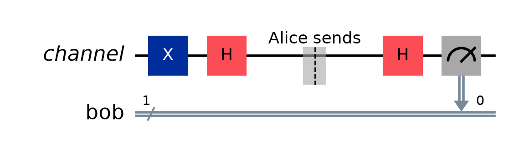
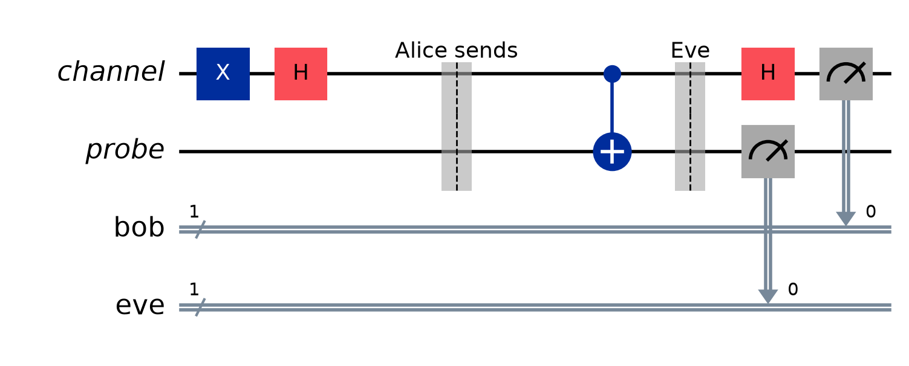

# BB84

Bennett and Brassard, 1984 — the first quantum key distribution protocol.
Code: [`bb84.py`](bb84.py), which runs locally or with `--ibm`.

BB84 does not encrypt anything and does not send a chosen message. It gives Alice
and Bob a shared string of random bits, and guarantees that if anyone listened
while they built it, they find out. The product is detection, not secrecy. A key
nobody watched is kept; a key somebody watched is thrown away before it is used.

## Two bases

A bit goes into a qubit in one of two ways:

| Bit | $Z$ basis | $X$ basis |
| :-: | :-: | :-: |
| 0 | $\vert 0\rangle$ | $\vert +\rangle = \tfrac{1}{\sqrt2}(\vert 0\rangle + \vert 1\rangle)$ |
| 1 | $\vert 1\rangle$ | $\vert -\rangle = \tfrac{1}{\sqrt2}(\vert 0\rangle - \vert 1\rangle)$ |

The bases are conjugate — every state of one sits exactly halfway between the
states of the other, so $\big|\langle a | b \rangle\big|^2 = \tfrac12$ for any $a$
from one and $b$ from the other.

Measuring in the wrong basis therefore gives a coin flip, and destroys the state on
the way. Not a partial answer, not a noisy answer — no answer at all, and the
original is gone. That one fact is the security of BB84; the rest is bookkeeping
around it.

## The protocol

Alice picks a random bit and a random basis each round and sends the matching
state. Bob picks his own random basis and measures, with no idea which one Alice
used. Then, over a public channel, they announce their *bases* — never their bits —
and throw away every round where the bases disagreed. About half survive. Of those,
they sacrifice a random subset, compare them openly, and discard them. If the error
rate on that subset is low enough the rest becomes the key, and if not they abort.



One clean round: Alice sends $|-\rangle$, Bob happens to choose $X$ too, and reads
1 with certainty. When the bases match, Bob's Hadamard undoes Alice's:

$$|1\rangle \xrightarrow{H} |-\rangle \xrightarrow{\text{channel}} |-\rangle \xrightarrow{H} |1\rangle$$

When they do not match his result is a coin flip, which is why those rounds are
discarded rather than corrected.

## Eve cannot copy the qubit

The obvious attack is to keep a copy and forward the original. Suppose some unitary
$U$ cloned any state, $U|\psi\rangle|0\rangle = |\psi\rangle|\psi\rangle$. On the
basis states that gives $U|0\rangle|0\rangle = |00\rangle$ and
$U|1\rangle|0\rangle = |11\rangle$. Now feed it $|+\rangle$. Linearity forces

$$U|+\rangle|0\rangle = \tfrac{1}{\sqrt2}\big(|00\rangle + |11\rangle\big)$$

while cloning demands $|+\rangle|+\rangle$, which expands to an equal mixture of
all four basis states. The first is entangled and the second is a product, so no
such $U$ exists. That is the no-cloning theorem, and what did the work was nothing
but linearity — the same property that makes superposition possible.

So Eve has to measure, and measuring means guessing a basis.

## Intercept-resend costs 25%

Eve's simplest attack is to measure each qubit in a basis she guesses and send on
what she found. On the rounds that survive sifting, where Alice and Bob agreed:

- half the time she guesses Alice's basis, learns the bit exactly, and Bob still
  sees the right value;
- half the time she guesses wrong, learns a coin flip, and Bob then gets the wrong
  bit half the time.



So the error rate Alice and Bob measure is $\tfrac12 \times \tfrac12 = \tfrac14$.
A quarter of the bits that should agree do not, and Eve cannot choose to pay less:
not measuring means learning nothing.

Each compared bit is an independent $\tfrac34$ chance of slipping past, so
detection is fast — over 50 compared bits she escapes with probability $6\times10^{-7}$.

What she gets for it is $\tfrac12 \cdot 1 + \tfrac12 \cdot \tfrac12 = \tfrac34$ of
the surviving key, against 50% for guessing. An undetected Eve would be a disaster;
the protocol's answer is not to make her attack fail but to make it loud.

## Why abort at 11%

A real channel is noisy, and Alice and Bob cannot tell noise from eavesdropping, so
they assume the worst and ask how much key survives it. Under Shor–Preskill the
extractable fraction at error rate $Q$ is

$$r = 1 - 2h(Q), \qquad h(Q) = -Q\log_2 Q - (1-Q)\log_2(1-Q)$$

One $h(Q)$ pays for error correction and the other for privacy amplification. The
rate hits zero when $h(Q) = \tfrac12$, which is a QBER of about 11%. Intercept-resend
produces 25%, well past it — and the gap between the two is the room a noisy device
has to work in.

## Running it

```bash
uv run python 03_Protocols/bb84.py
uv run python 03_Protocols/bb84.py --eve
uv run python 03_Protocols/bb84.py --eve --ibm
```

With `--eve` over 4096 rounds the run gives 25.8% mismatches against a predicted
25%, aborts, and shows Eve holding 75.0% of the key against a predicted 75%.
Without `--eve` it gives 0.0% and two identical keys.

On hardware the picture changes, and this is the honest limitation: readout error
alone puts a few percent of mismatches on the channel before Eve does anything, and
nothing in the protocol can tell the two apart. That is not a flaw in the
implementation — it is the reason the threshold exists at all, and why real systems
budget a noise floor well under 11%.

Eve here keeps a probe rather than measuring in flight. By the deferred measurement
principle that is the same attack with the same statistics, and it is if anything
the stronger attacker: she holds a quantum memory and decides later what to do with
it. BB84 survives her anyway.
