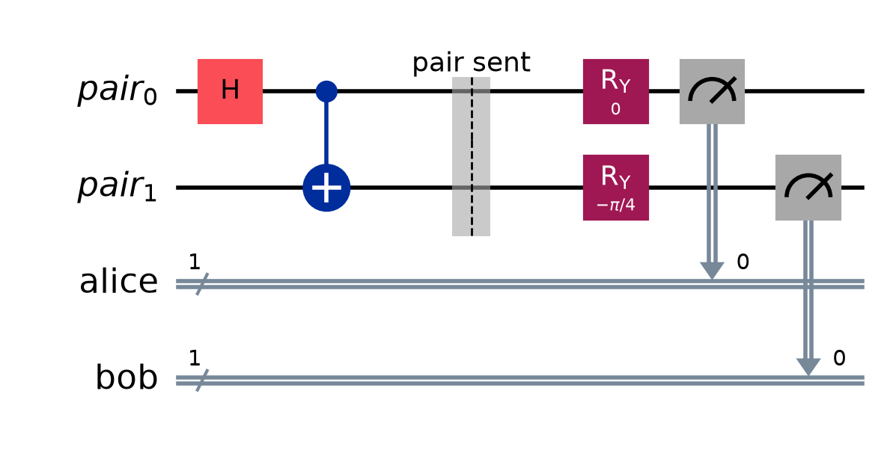
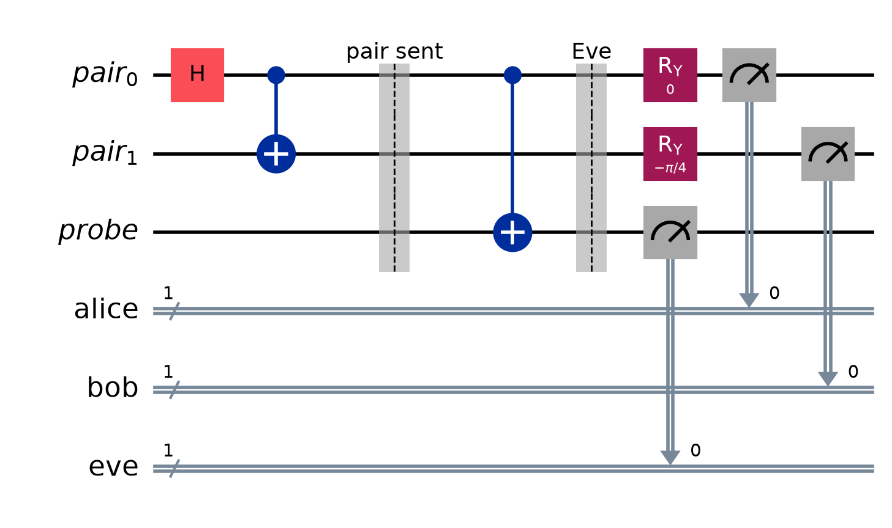

# E91

Artur Ekert's 1991 key distribution protocol. Runnable version: [`e91.py`](e91.py).

[BB84](BB84.md) catches an eavesdropper by noticing that **measurement disturbs a
state**. E91 catches her by noticing that **entanglement has gone missing** — and
it detects this with Bell's inequality, so the security check is a statement about
physics rather than about anyone's equipment.

The structural payoff is that the check is **free**. BB84 buys its security by
sacrificing key bits; E91's test uses rounds whose settings disagreed, which were
going to be discarded anyway.

## The source

Neither party prepares anything. A source in the middle emits entangled pairs and
sends one qubit to each:

$$|\Phi^+\rangle = \tfrac{1}{\sqrt2}\big(|00\rangle + |11\rangle\big)$$

Ekert's original used the anti-correlated singlet; $|\Phi^+\rangle$ is the same
protocol with Bob's bits un-flipped, and it is the Bell circuit already built in
[Superdense_Coding](Superdense_Coding.md) and [Quantum_Teleportation](Quantum_Teleportation.md) — $H$ then CNOT.

Note who is trusted: **nobody**. The source can be built and operated by Eve
herself. If she sends anything other than genuine entangled pairs, the test below
catches her, which is a much weaker assumption than BB84 needs.

## Measuring along an axis

Each party measures spin along an axis at angle $\theta$ in the plane — the
observable

$$A(\theta) = \cos\theta \; Z + \sin\theta \; X$$

Rotating the state by $-\theta$ about $Y$ carries that axis onto $Z$, so "choose a
measurement basis" is implemented as one $R_y(-\theta)$ followed by an ordinary
computational-basis measurement. At $\theta = 0$ this is the $Z$ basis and at
$\theta = \pi/2$ it is the $X$ basis, so BB84's two bases are two points on the
circle E91 uses all of.

Reading outcome 0 as $+1$ and outcome 1 as $-1$, the correlation between the two
sides is

$$E(\theta_a, \theta_b) = \langle \Phi^+ | A(\theta_a) \otimes A(\theta_b) | \Phi^+ \rangle$$

For $|\Phi^+\rangle$ the only surviving terms are $\langle ZZ \rangle = 1$ and
$\langle XX \rangle = 1$, with $\langle ZX \rangle = \langle XZ \rangle = 0$, so

$$E = \cos\theta_a\cos\theta_b + \sin\theta_a\sin\theta_b = \boxed{\cos(\theta_a - \theta_b)}$$

The correlation depends only on the **angle between the two axes**, not on either
one separately. Same axis, perfect agreement; perpendicular axes, nothing at all.



*One round: the pair is made, sent, and each side rotates to its own axis before
measuring. Here Alice is at $0°$ and Bob at $45°$, so $E = \cos 45° = 0.707$.*

## Three settings each

Alice measures at $0°$, $45°$ or $90°$; Bob at $45°$, $90°$ or $135°$. Both choose
at random and independently, every round. Nine combinations result, and
$E = \cos(\theta_a - \theta_b)$ fills the grid:

| | $B_1 = 45°$ | $B_2 = 90°$ | $B_3 = 135°$ |
| :--- | :-: | :-: | :-: |
| $A_1 = 0°$ | $+\tfrac{1}{\sqrt2}$ **test** | $0$ *discard* | $-\tfrac{1}{\sqrt2}$ **test** |
| $A_2 = 45°$ | $+1$ **key** | $+\tfrac{1}{\sqrt2}$ *discard* | $0$ *discard* |
| $A_3 = 90°$ | $+\tfrac{1}{\sqrt2}$ **test** | $+1$ **key** | $+\tfrac{1}{\sqrt2}$ **test** |

- **key** ($\tfrac29$ of rounds) — the axes coincide, so $E = 1$ and the two
  outcomes are *always identical*. Neither party chose the bit; they read the same
  random bit off a shared pair. That is the key.
- **test** ($\tfrac49$) — the axes are $45°$ apart, which is where the inequality
  below is maximally violated.
- **discard** ($\tfrac39$) — announced and dropped, as in BB84's sifting.

## CHSH, and why 2 is the line

Take the four test settings and combine them:

$$S = E(A_1,B_1) - E(A_1,B_3) + E(A_3,B_1) + E(A_3,B_3)$$

**The classical bound.** Suppose the outcomes were simply *there* before anyone
measured — each round carrying values $a_1, a_3, b_1, b_3 \in \{+1, -1\}$, one for
each setting that might be chosen. Then for that round

$$S_{\text{round}} = a_1b_1 - a_1b_3 + a_3b_1 + a_3b_3 = a_1(b_1 - b_3) + a_3(b_1 + b_3)$$

Since $b_1$ and $b_3$ are each $\pm 1$, either they are equal — making $b_1 - b_3 = 0$
and $b_1 + b_3 = \pm2$ — or they differ, making $b_1 + b_3 = 0$ and
$b_1 - b_3 = \pm2$. Exactly one bracket survives, and it contributes $\pm 2$:

$$|S_{\text{round}}| = 2 \quad\Longrightarrow\quad |S| \le 2$$

Averaging over rounds cannot exceed what every round achieves. **No theory in which
the bits existed before measurement can beat 2**, whatever mechanism produced them,
however cleverly correlated in advance.

**The quantum value.** Plug in $E = \cos(\theta_a - \theta_b)$:

$$S = \cos(-45°) - \cos(-135°) + \cos(45°) + \cos(-45°) = 4 \cdot \tfrac{1}{\sqrt2} = 2\sqrt2 \approx 2.828$$

Quantum mechanics beats the bound, and $2\sqrt2$ is the most *any* quantum state
and measurements can manage — **Tsirelson's bound**. The whole protocol lives in
the gap between $2$ and $2\sqrt2$.

## What an eavesdropper costs

Eve's problem is **monogamy of entanglement**: a maximally entangled pair is
entangled with *each other and nothing else*. To learn about Alice's qubit she has
to correlate herself with it, and that correlation can only come out of the
Alice–Bob correlation. Reducing it is not a side effect of a clumsy attack; it is
what learning means here.

Concretely, if she copies Alice's qubit in the $Z$ basis, the pair becomes a
classical mixture over $Z$ outcomes: $\langle ZZ \rangle = 1$ but
$\langle XX \rangle = 0$, so $E = \cos\theta_a\cos\theta_b$. Copying in $X$ gives
the mirror image, $E = \sin\theta_a\sin\theta_b$. An Eve who picks her basis at
random averages the two:

$$E_{\text{Eve}} = \tfrac12\big(\cos\theta_a\cos\theta_b + \sin\theta_a\sin\theta_b\big) = \tfrac12\cos(\theta_a - \theta_b)$$

**She halves every correlation in the grid.** Two consequences follow immediately:

$$S: \; 2\sqrt2 \to \sqrt2 \approx 1.414, \qquad \text{key QBER}: \; 0 \to \frac{1 - \tfrac12}{2} = 25\%$$

$\sqrt2$ is below the classical bound, so the violation is not merely reduced — it
is **gone**, and the correlations that remain are ones a pre-agreed list of bits
could have produced. And the 25% is precisely BB84's number, arrived at from a
completely different direction.



*Eve entangles a `probe` with Alice's half before it is measured. She does not need
to look at it — entangling with a third system is itself what destroys the
Alice–Bob entanglement, so $S$ collapses whether or not she ever reads her result.*

## What Eve learns

Her copy collapses Alice's qubit onto Eve's own axis; Alice then measures at angle
$\theta$ away from it and agrees with probability $\cos^2(\theta/2)$. Averaged over
her two bases and the two key settings:

$$\tfrac14\Big[\underbrace{2\cos^2\tfrac{\pi}{8}}_{A_2 \text{ at } 45°} + \underbrace{\cos^2\tfrac{\pi}{4} + \cos^2 0}_{A_3 \text{ at } 90°}\Big] = 80.2\%$$

The script measures 79.7% over 8192 rounds. As in BB84, she does learn most of the
key — and as in BB84, it does her no good, because the key is discarded.

## Running it

```bash
uv run python 03_Protocols/e91.py
uv run python 03_Protocols/e91.py --eve
uv run python 03_Protocols/e91.py --rounds 8192
```

Simulated exactly with `StatevectorSampler` — no Aer, no IBM account, no hardware.
Only $\tfrac29$ of rounds make key and $\tfrac49$ feed the test, so `--rounds`
needs to be generous.

Over 8192 pairs on a clean channel:

```
    setting  rounds  sign  E measured   E ideal
      A1,B1     923    +1      +0.710    +0.707
      A1,B3     914    -1      -0.702    -0.707
      A3,B1     915    +1      +0.727    +0.707
      A3,B3     901    +1      +0.705    +0.707

  S = 2.844 +/- 0.047      -> VIOLATED by 18.1 sigma
  key rounds 1796, Alice and Bob differ in 0 = 0.0%
```

and the same run with `--eve`:

```
  S = 1.324 +/- 0.062      -> NOT VIOLATED (1.324 <= 2). ABORT
  key rounds 1725, Alice and Bob differ in 452 = 26.2%
  key bits she has right  1374/1725 = 79.7%   (prediction 80.2%)
```

Every number lands where the algebra above says it should: $2.83 \to 1.41$,
$0\% \to 25\%$, and Eve at $80\%$.

> [!note] $S$ can come out slightly above $2\sqrt2$
> A measured $S$ of, say, $2.90$ is a finite-sample fluctuation in the *estimate*
> of $S$, not a violation of Tsirelson's bound. The error bar covers it, and more
> rounds shrink it. The script says so when it happens.

## Running it on real IBM hardware

[`e91_ibm.py`](e91_ibm.py) imports the round from `e91.py`, so the protocol cannot
drift between the two.

```bash
uv run python 03_Protocols/e91_ibm.py            # dry run, submits nothing
uv run python 03_Protocols/e91_ibm.py --submit   # queue a real job
```

**This is the one protocol in this vault that today's hardware runs well.** A round
is one entangling gate and two rotations, and the CHSH violation is among the few
textbook quantum effects a current device reproduces convincingly.

All 9 configurations (18 with Eve) are packed side by side onto their own qubits of
a **single** circuit, so one shot samples every configuration at once and $N$ shots
supply an entire $N$-round protocol from one circuit execution. On a 133-qubit
device with Eve: 18 configurations, 54 qubits, ISA depth 17, 36 two-qubit gates.

Because each correlation is a product of two measured bits, a readout error of $p$
scales every $E$ by roughly $(1-2p)^2$, and $S$ with it. The script turns the
backend's own calibration into a prediction before you spend anything:

$$S_{\text{predicted}} \approx 2\sqrt2 \cdot (1-2p)^2(1-\varepsilon)$$

which on a device with 2.3% readout error and 0.42% two-qubit error gives
$S \approx 2.56$ — short of $2.83$, comfortably past $2$.

### Noise pushes $S$ the same way Eve does

The honest difficulty, and it is the same one BB84 has: a noisy device produces a
lower $S$, and so does an eavesdropper, and the number does not say which. The
protocol's answer is to **blame all of it on Eve** and refuse the key either way —
which is safe, and is why a device that cannot clear $S = 2$ on its own cannot run
E91 at all.

So run once **without** `--eve` first. That measured $S$ is the device's honest
ceiling, and every later run is read against it rather than against $2.828$.

### What this does not prove

The demonstration is real, but it is **not a loophole-free Bell test**. Alice, Bob,
Eve and the source are all patches of silicon a millimetre apart on one chip,
sharing a control system and a clock. Nothing is space-like separated, so the
locality loophole is wide open: in principle the "Alice" qubit could be influenced
by Bob's setting through some mundane channel on the device.

Closing that loophole is a serious experiment — the 2015 tests at Delft, NIST and
Vienna needed detectors hundreds of metres to kilometres apart with fast random
setting choices. What runs here shows that the **correlations** are what quantum
mechanics predicts and that they collapse when a third party listens in. It does
not, by itself, rule out a local explanation.

The same caveat applies to the security claim. E91 is the ancestor of
**device-independent** QKD, where the CHSH violation certifies secrecy without
trusting the hardware. Genuine device independence needs the separation this
implementation does not have.

## E91 versus BB84

| | [BB84](BB84.md) | E91 |
| :--- | :--- | :--- |
| Resource | single qubits, prepared and sent | entangled pairs from a shared source |
| Who must be trusted | Alice's source and Bob's detector | in principle, nobody — even Eve may run the source |
| Detects Eve by | disturbance and no-cloning | loss of a Bell inequality violation |
| Cost of the check | **sacrificed key bits** | free — uses rounds already being discarded |
| Key yield | $\tfrac12$ of rounds, minus the check | $\tfrac29$ of rounds |
| Signature of an attack | QBER $0 \to 25\%$ | $S: 2\sqrt2 \to \sqrt2$, QBER $0 \to 25\%$ |

BB84 is cheaper and yields more key. E91 needs entanglement and throws most rounds
away, and buys with that a security argument resting on a *theorem about physics*
rather than on assumptions about equipment.

---

Related: [BB84](BB84.md), [Entanglement_Criterion](../01_Foundations/Entanglement_Criterion.md), [Measurement_and_Perspective](../01_Foundations/Measurement_and_Perspective.md), [Superdense_Coding](Superdense_Coding.md), [Quantum_Teleportation](Quantum_Teleportation.md)
