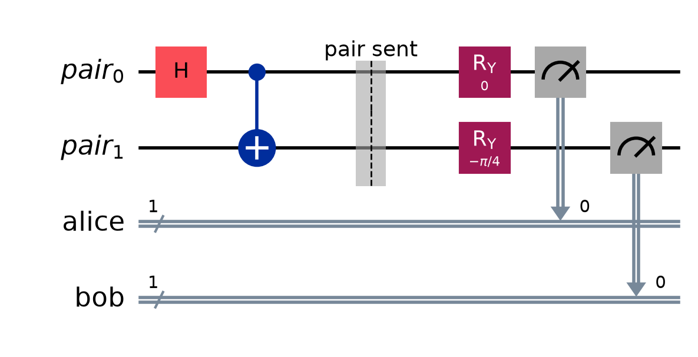
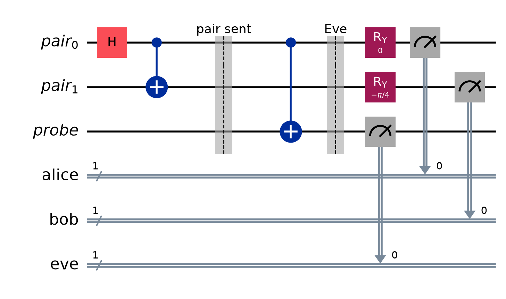

# E91

Ekert, 1991 — key distribution built on entanglement rather than on sending
prepared states. Code: [`e91.py`](e91.py), which runs locally or with `--ibm`.

Where [BB84](BB84.md) detects Eve because measuring disturbs a state, E91 detects
her because measuring destroys entanglement. The test is a Bell inequality, so
what Alice and Bob check is not an error rate but whether their results could have
come from a classical source at all.

## The source

Neither party prepares anything. A source in the middle emits entangled pairs and
sends one qubit each:

$$|\Phi^+\rangle = \tfrac{1}{\sqrt2}\big(|00\rangle + |11\rangle\big)$$

It is the same Bell circuit as in [Superdense_Coding](Superdense_Coding.md) and
[Quantum_Teleportation](Quantum_Teleportation.md) — $H$ then CNOT. Ekert's original
used the anti-correlated singlet; this is the same protocol with Bob's bits
un-flipped.

Nobody is trusted, including the source. Eve can build and operate it herself: if
she sends anything other than genuine entangled pairs the test below catches her,
which is a far weaker assumption than BB84 needs.

## Measuring along an axis

Each party measures spin along an axis at angle $\theta$ in the plane, the
observable $A(\theta) = \cos\theta \, Z + \sin\theta \, X$. Rotating by $-\theta$
about $Y$ carries that axis onto $Z$, so choosing a basis is one $R_y(-\theta)$
followed by an ordinary measurement. At $\theta = 0$ that is the $Z$ basis and at
$\pi/2$ the $X$ basis, so BB84's two bases are two points on the circle E91 uses
all of.

Reading outcome 0 as $+1$ and 1 as $-1$, the only surviving terms for
$|\Phi^+\rangle$ are $\langle ZZ\rangle = \langle XX\rangle = 1$, so the
correlation is

$$E(\theta_a, \theta_b) = \cos\theta_a\cos\theta_b + \sin\theta_a\sin\theta_b = \cos(\theta_a - \theta_b)$$

It depends only on the angle *between* the axes, not on either one. Same axis,
perfect agreement; perpendicular axes, nothing.



## Three settings each

Alice measures at $0°$, $45°$ or $90°$, Bob at $45°$, $90°$ or $135°$, both
choosing at random every round. Nine combinations, filled in by
$E = \cos(\theta_a - \theta_b)$:

| | $B_1 = 45°$ | $B_2 = 90°$ | $B_3 = 135°$ |
| :--- | :-: | :-: | :-: |
| $A_1 = 0°$ | $+\tfrac{1}{\sqrt2}$ test | $0$ discard | $-\tfrac{1}{\sqrt2}$ test |
| $A_2 = 45°$ | $+1$ key | $+\tfrac{1}{\sqrt2}$ discard | $0$ discard |
| $A_3 = 90°$ | $+\tfrac{1}{\sqrt2}$ test | $+1$ key | $+\tfrac{1}{\sqrt2}$ test |

On the two **key** settings the axes coincide, $E = 1$, and the outcomes are always
identical — neither party chose the bit, they just read the same random bit off a
shared pair. The four **test** settings are $45°$ apart, where the inequality below
is maximally violated. The rest is announced and dropped, as in BB84's sifting.

Only $\tfrac29$ of rounds become key, which is why this needs far more rounds than
BB84 for the same key length.

## CHSH

Combine the four test settings:

$$S = E(A_1,B_1) - E(A_1,B_3) + E(A_3,B_1) + E(A_3,B_3)$$

Suppose the outcomes were simply *there* before anyone measured, each round
carrying values $a_1, a_3, b_1, b_3 \in \{+1,-1\}$. Then

$$S_{\text{round}} = a_1(b_1 - b_3) + a_3(b_1 + b_3)$$

Since $b_1, b_3$ are each $\pm1$, either they are equal — so $b_1 - b_3 = 0$ and
$b_1 + b_3 = \pm2$ — or they differ and it is the other way round. Exactly one
bracket survives and contributes $\pm2$, so $|S| \le 2$ for every round, and
averaging cannot beat what every round achieves.

That bound holds for *any* theory in which the bits existed before measurement,
whatever produced them and however cleverly they were correlated in advance.

Quantum mechanics gives $S = 4\cos 45° = 2\sqrt2 \approx 2.828$, and that is the
most any quantum state can manage (Tsirelson's bound). The protocol lives entirely
in the gap between $2$ and $2\sqrt2$.

## What Eve costs

Her problem is monogamy of entanglement: a maximally entangled pair is entangled
with each other and nothing else. To learn about Alice's qubit she must correlate
herself with it, and that correlation can only come out of the Alice–Bob
correlation. Reducing it is not a side effect of a clumsy attack — it is what
learning means here.

If she copies Alice's qubit in $Z$, the pair becomes a classical mixture over $Z$
outcomes and $E = \cos\theta_a\cos\theta_b$. Copying in $X$ gives the mirror image.
An Eve choosing at random averages the two:

$$E_{\text{Eve}} = \tfrac12\cos(\theta_a - \theta_b)$$

She halves every correlation in the grid, which takes $S$ from $2\sqrt2$ to
$\sqrt2 \approx 1.414$ and the key error rate from 0 to 25%. The violation is not
merely reduced, it is gone — what remains is exactly what a pre-agreed list of bits
could have produced. And the 25% is BB84's number, reached from a completely
different direction.



She does not even need to look at her probe. Entangling with a third system is
itself what destroys the Alice–Bob entanglement, so $S$ collapses whether or not
she ever reads her result.

She does learn about 80% of the key — and as in BB84 it does her no good, because
the key is discarded.

## Running it

```bash
uv run python 03_Protocols/e91.py
uv run python 03_Protocols/e91.py --eve
uv run python 03_Protocols/e91.py --ibm
```

A clean run over 4096 pairs gives $S = 2.782 \pm 0.067$ — a clear violation, inside
Tsirelson's bound. With `--eve` it drops to about 1.34, well under 2.

On hardware $S$ falls on its own, because decoherence degrades the same
correlations Eve would. A dip is therefore not proof of an eavesdropper, and this
is the same limitation BB84 has: the protocol cannot distinguish noise from
attack, and assumes the worst. What a hardware run does show is a genuine
violation surviving real noise, which is the interesting part.
