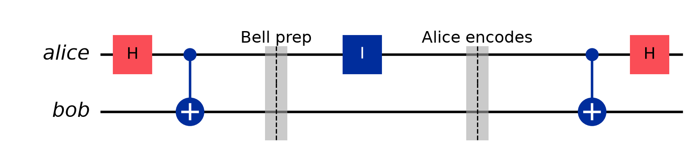

# Superdense Coding

The protocol that can transfer **2 classical bits** by physically transferring
**one qubit**.

## Setup

For the initial step, 2 particles need to be in an entangled state:

$$\tfrac{1}{\sqrt2}|00\rangle + \tfrac{1}{\sqrt2}|11\rangle$$

- Alice and Bob each have one particle.
- Alice wants to send two classical bits of information (00, 01, 10 or 11).
- Alice starts with $|00\rangle$.
- Depending on which 2 classical bits Alice wants to send, she will act on **her**
  qubit in one of 4 ways.

## Encoding table

| Bits to send | Alice applies |
| :-: | :-: |
| 00 | $I$ |
| 01 | $X$ |
| 10 | $Z$ |
| 11 | $Y$ (or $ZX$) |


## Example — Alice wants to send 00



- **Bell prep** (first $H$ + CNOT) changes the basis and makes the target depend on the control.
- **Alice encodes** by acting on her wire only.
- The last CNOT + $H$ is Bob reverting the Bell circuit — the involution from [Involutions](../02_Gates/Involutions.md) — which decodes.

$$|00\rangle \xrightarrow{\;H\;} \tfrac{1}{\sqrt2}\big(|00\rangle + |10\rangle\big) \xrightarrow{\;\text{CNOT}\;} \tfrac{1}{\sqrt2}\big(|00\rangle + |11\rangle\big) \xrightarrow{\;I\;} \text{same}$$

Alice sends her qubit to Bob, who undoes the Bell circuit:

$$\xrightarrow{\;\text{CNOT}\;} \tfrac{1}{\sqrt2}\big(|00\rangle + |10\rangle\big) \xrightarrow{\;H\;} |00\rangle$$

## Example — Alice wants to send 01


$$|00\rangle \xrightarrow{\;H\;} \tfrac{1}{\sqrt2}\big(|00\rangle + |10\rangle\big) \xrightarrow{\;\text{CNOT}\;} \tfrac{1}{\sqrt2}\big(|00\rangle + |11\rangle\big) \xrightarrow{\;X\;} \tfrac{1}{\sqrt2}\big(|10\rangle + |01\rangle\big)$$

Bob:

$$\xrightarrow{\;\text{CNOT}\;} \tfrac{1}{\sqrt2}\big(|11\rangle + |01\rangle\big) \xrightarrow{\;H\;} |01\rangle$$

## The shape of the protocol

$$\text{Entangle} \;\to\; \text{separate} \;\to\; \text{Alice applies gate} \;\to\; \text{Alice sends qubit to Bob} \;\to\; \text{Bob decodes both qubits and measures}$$

The key point: Alice acting on **only her own qubit** moves the *pair* between four
mutually distinguishable Bell states, and Bob — holding both qubits at the end —
can tell them apart perfectly.

## In Qiskit

```python
from qiskit import QuantumCircuit
from qiskit.quantum_info import Statevector

def superdense(bits: str) -> QuantumCircuit:
    qc = QuantumCircuit(2)
    qc.h(0); qc.cx(0, 1)              # Bell prep (shared beforehand)
    if bits in ("01", "11"): qc.x(0)  # Alice encodes on her qubit
    if bits in ("10", "11"): qc.z(0)
    qc.cx(0, 1); qc.h(0)              # Bob decodes (reverse Bell)
    return qc

for b in ("00", "01", "10", "11"):
    # Qiskit prints little-endian, so the string comes out reversed:
    # sending "01" prints "10". Read it as (q0, q1) = (Alice, Bob).
    print(b, Statevector(superdense(b)).probabilities_dict())
```

---

The inverse protocol: [Quantum_Teleportation](Quantum_Teleportation.md).
