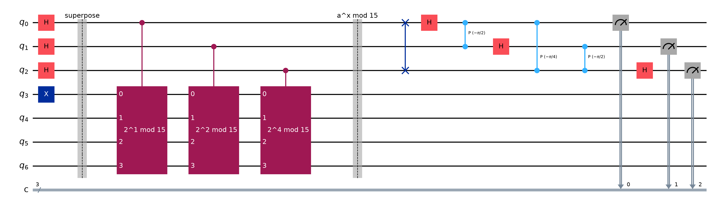

# Shor's Algorithm

Factoring $N = 15$ into $3 \times 5$. Runnable version: [`shors_15.py`](shors_15.py).

## What the algorithm actually is

Shor's is **mostly classical number theory with one quantum subroutine**. That
framing matters, because the famous part is a small piece of it:

| Step | Where it runs |
| :--- | :--- |
| Pick $a$ coprime to $N$ | classical |
| Check $\gcd(a, N) \neq 1$ (a lucky hit) | classical |
| **Find the period $r$ of $f(x) = a^x \bmod N$** | **quantum** |
| Turn $r$ into factors via $\gcd(a^{r/2} \pm 1,\, N)$ | classical |

Only period-finding is quantum. Everything else is arithmetic you could do by
hand. The quantum computer is not "trying factors in parallel" — it is doing one
specific thing that classical computers are slow at: finding the period of a
function.

## Why factoring reduces to period-finding

If $r$ is the period of $a^x \bmod N$, then $a^r \equiv 1 \pmod N$, so:

$$a^r - 1 \equiv 0 \pmod N$$

If $r$ is **even**, that factors as a difference of squares:

$$\left(a^{r/2} - 1\right)\left(a^{r/2} + 1\right) \equiv 0 \pmod N$$

So $N$ divides that product, and $\gcd(a^{r/2} \pm 1,\, N)$ is very likely a
non-trivial factor. Two ways this fails, both cheap to detect and retry:

- $r$ is **odd** — then $r/2$ is not an integer.
- $a^{r/2} \equiv -1 \pmod N$ — then $\gcd(a^{r/2}+1, N) = N$, giving nothing.

For $N = 15$, $a = 14$ is the failing case; $a \in \{2, 4, 7, 8, 11, 13\}$ all work.

## Why $N = 15$

Not just convention — 15 is the **smallest number Shor's can be demonstrated on**.
$N$ must be odd (else 2 is a factor), composite, and not a prime power. That rules
out everything below it: 9 and 25 are prime powers, everything else is even or
prime. So 15 is the first candidate, and $15 = 3 \times 5$.

It has a second, more practical advantage. For $N = 15$, multiplying by $a$ mod 15
just **permutes** the four work qubits, so the modular arithmetic is built entirely
from SWAP and X gates — no adders, no ancillas. That is what makes the circuit
small enough to write out by hand and read.

## The circuit

Quantum phase estimation applied to the operator "multiply by $a$ mod 15":



*(drawn with 3 counting qubits so it stays legible; the runnable script uses 8)*

Three stages:

1. **Superpose** — Hadamard every counting qubit, so the top register holds every
   exponent $x$ at once. The work register starts at $|1\rangle$.
2. **Modular exponentiation** — controlled multiplication by $a^{2^j} \bmod 15$,
   building $\sum_x |x\rangle|a^x \bmod 15\rangle$. The period $r$ is now encoded
   in the state, but *not yet readable*: measuring here gives one random $x$.
3. **Inverse QFT** — converts the period hidden in the register into a phase that
   measurement can actually see. This is the step that does the work.

## Why the imaginary numbers are unavoidable here

The inverse QFT is built from controlled-phase gates $P(\theta)$ applying
$e^{i\theta}$, and here the angles are $-\pi/2$, $-\pi/4$, $-\pi/8, \dots$ — they
are visible in the figure above. Those are not real numbers:

$$e^{-i\pi/2} = -i, \qquad e^{-i\pi/4} = \tfrac{1}{\sqrt2} - \tfrac{i}{\sqrt2}$$

Checked numerically: the $16 \times 16$ QFT matrix has entries with imaginary parts
up to $0.25$ in magnitude. There is no real-amplitude version. In
[Single_Qubit_Gates](../02_Gates/Single_Qubit_Gates.md) the "relative phase" was a sign, $\pm 1$ — the only two
phases reachable with real numbers. Shor's needs the phase to take a *continuum* of
values, because the period is read off from **how far around the circle** the phase
has gone. A sign can only ever encode "half a turn"; you cannot encode $s/r$ for
arbitrary $r$ in it.

This is the concrete answer to the question parked in
[Real_vs_Complex_Amplitudes](../99_TODO/Real_vs_Complex_Amplitudes.md): real amplitudes carry you through entanglement,
teleportation, superdense coding and Grover. They stop at the QFT.

## Reading the output

```
    measured  decimal     phase    ~ s/r    r  shots
    01000000       64    0.2500      1/4    4  285
    10000000      128    0.5000      1/2    2  260
    00000000        0    0.0000        0    1  252
    11000000      192    0.7500      3/4    4  227
```

Each measurement gives an integer; dividing by $2^8$ gives a phase. The phase
approximates $s/r$ for some integer $s$ — so **continued fractions**
(`Fraction.limit_denominator`) recover $r$ from it.

Note the four outcomes are roughly equally likely, and **two of them are useless**:
$s = 0$ gives $r = 1$, and $s/r = 1/2$ gives $r = 2$, which fails the check
$a^r \equiv 1$. This is normal. Shor's is probabilistic — you run it, discard the
duds, and retry. Roughly half the shots here are informative.

With $r = 4$ recovered:

$$2^{4/2} \bmod 15 = 4, \qquad \gcd(3, 15) = 3, \qquad \gcd(5, 15) = 5$$

$$15 = 3 \times 5$$

## Running it

```bash
uv run python 04_Algorithms/shors_15.py
uv run python 04_Algorithms/shors_15.py --a 7 --shots 2048
```

Simulated exactly with Qiskit's built-in `StatevectorSampler` — no Aer, no IBM
account, no hardware. Twelve qubits is a 4096-amplitude statevector, which is
nothing for a laptop.

## Running it on real IBM hardware

[`shors_15_ibm.py`](shors_15_ibm.py) imports the circuit from `shors_15.py`, so the
algorithm cannot drift between the two. What it adds is what hardware needs:
authentication, backend selection, transpilation to the device's ISA, and error
suppression. The setup follows the pattern from
[`../../qiskit-fundamentals/week_5/3-transpilation.ipynb`](../../qiskit-fundamentals/week_5/3-transpilation.ipynb).

```bash
uv run python 04_Algorithms/shors_15_ibm.py            # dry run, submits nothing
uv run python 04_Algorithms/shors_15_ibm.py --submit   # queue a real job
```

**A dry run is the default.** It transpiles against a local fake backend with a real
device's topology and gate set, reports what the job would cost, and submits
nothing. Only `--submit` touches your quota.

### The counting register is the whole ballgame

The textbook uses 8 counting qubits. Transpiled, that is what it costs:

| Counting qubits | Logical qubits | ISA depth | 2-qubit gates | Est. fidelity |
| :-: | :-: | --: | --: | --: |
| 2 | 6 | 778 | 238 | ~37% |
| 3 | 7 | 1875 | 579 | ~9% |
| 4 | 8 | 4232 | 1235 | ~0.6% |
| **8** | **12** | **74291** | **21595** | **~0%** |

*(transpiled at optimization level 3 for a 133-qubit device, median two-qubit error
$4.2 \times 10^{-3}$; fidelity is the crude $(1-\varepsilon)^{n}$ estimate the script
prints)*

The textbook circuit is **pure noise** on today's hardware — 21,595 two-qubit gates
at a 0.4% error rate each leaves nothing. This is not a flaw in the script; it is
the actual state of the field.

But for $N = 15$ the measured phases are exactly $0, \tfrac14, \tfrac12, \tfrac34$ —
so **2 counting qubits resolve them with no loss at all**. Verified on the
simulator: 2, 3, 4 and 8 counting qubits all recover $r = 4$ at the same ~48.6%
success rate. Two bits is 90x cheaper and lands in plausible territory, which is
why it is the default here.

That trade — spend the minimum precision the problem actually needs — is the
central move in getting anything to run on current devices.

### How do you know it really ran on IBM, and that it worked?

Three independent questions, and the script answers each separately.

**1. Did it run on real hardware?** The script prints provenance that comes from
IBM, not from itself: job id, backend name, `simulator` flag, qubit count, status,
timestamps and quota usage. It flags loudly if `simulator` is true. The
independent check is the job id — look it up at
[quantum.cloud.ibm.com/workloads](https://quantum.cloud.ibm.com/workloads). If it
is not listed there, it did not run on IBM hardware.

```bash
uv run python 04_Algorithms/shors_15_ibm.py --job <job-id>    # re-read a past job
```

**2. Did the device actually compute anything?** A noiseless run only ever produces
bitstrings in the *ideal support*; uniform noise spreads over all $2^n$. So the
fraction of shots landing on the support, against what uniform noise would give,
measures whether anything quantum happened. The script reports it in sigma.

> [!warning] With 2 counting qubits this test is vacuous
> For $n = 2$ the ideal support is *all four* bitstrings, so **random noise scores
> 100%**. A run at `--counting 2` cannot distinguish a quantum computer from a coin
> flip, no matter how clean the output looks. It is cheap, and it proves nothing.

| Counting qubits | Ideal support | Uniform noise scores | Est. fidelity | Verdict |
| :-: | :-: | :-: | :-: | :--- |
| 2 | 4 of 4 | 100% | ~37% | unfalsifiable |
| **3** | **4 of 8** | **50%** | **~9%** | **~6σ — the sweet spot** |
| 4 | 4 of 16 | 25% | ~0.6% | signal too weak to detect |
| 8 | 4 of 256 | 1.6% | ~0% | pure noise |

Three counting qubits is the default because it is the only setting where the
result is both *achievable* and *falsifiable*. Validated by injecting uniform noise
into simulated results at the predicted fidelity: 9% fidelity gives $6.2\sigma$,
pure noise gives $-1.2\sigma$ and is correctly rejected.

**3. Is the answer right?** This is the easy one, and the reason none of the above
is load-bearing. Shor's output is **classically verifiable**:

```
[ok] 2^4 mod 15 == 1
[ok] 3 x 5 == 15
[ok] both factors non-trivial
[ok] 3 divides 15
```

Multiplying $3 \times 5$ is free. **You never have to trust the quantum computer** —
if the factors multiply back to $N$, they are correct, whatever produced them. That
asymmetry, hard to find and trivial to check, is exactly why factoring is the
canonical quantum application, and it is also why a noisy device is still useful:
you run it, check classically, and retry on failure.

### Error suppression

The script enables two things through `SamplerV2`:

- **Dynamical decoupling** (`XY4`) — pulse sequences on idling qubits that cancel
  low-frequency noise while they wait.
- **Twirling** of gates and measurements — randomises *coherent* errors into
  incoherent ones, which then average out over shots instead of compounding.

Neither fixes a circuit that is too deep; they buy margin on one that is close.

## Honest caveat

This circuit does not "discover" that $15 = 3 \times 5$ from scratch. The
SWAP-based modular multiplication is built by inspecting the permutation that
multiplying by $a$ mod 15 performs — which requires already knowing the answer.
Every small-$N$ Shor demonstration, including the hardware ones, does this; it is
sometimes called *compiled* Shor.

What the demonstration honestly shows is that **the period-finding machinery
works**. The part that does not scale is the modular arithmetic: a general
implementation needs full quantum adders (Beauregard-style), and that is where the
qubit counts explode from 12 to thousands.

---

Related: [Real_vs_Complex_Amplitudes](../99_TODO/Real_vs_Complex_Amplitudes.md), [Single_Qubit_Gates](../02_Gates/Single_Qubit_Gates.md), [From_Classical_To_Quantum](../02_Gates/From_Classical_To_Quantum.md)

Reference: [IBM Quantum — Shor's algorithm tutorial](https://quantum.cloud.ibm.com/docs/en/tutorials/shors-algorithm),
which factors 15 with the same structure (8 counting + 4 target qubits, SWAP-based
permutation, QPE, continued fractions) but runs it on real hardware via `SamplerV2`
with a transpiler pass manager and error mitigation.
