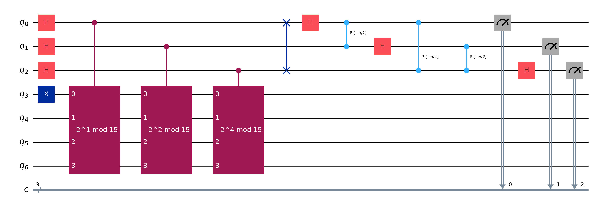

# Shor's Algorithm

Factoring $N = 15$ into $3 \times 5$. Code: [`shors.py`](shors.py).

## Structure

Shor's is mostly classical number theory with one quantum subroutine:

| Step | Runs on |
| :--- | :--- |
| Pick $a$ coprime to $N$ | classical |
| Find the period $r$ of $a^x \bmod N$ | **quantum** |
| Get factors from $\gcd(a^{r/2} \pm 1,\thinspace N)$ | classical |

It is not "trying every factor in parallel". Measuring before the final step gives
one random number; the algorithm lives in the interference that comes after.

## Why factoring reduces to period-finding

If $r$ is the period of $a^x \bmod N$ then $a^r \equiv 1 \pmod N$, so
$a^r - 1 \equiv 0$. When $r$ is even that factors as a difference of squares:

$$\left(a^{r/2} - 1\right)\left(a^{r/2} + 1\right) \equiv 0 \pmod N$$

$N$ divides that product, so $\gcd(a^{r/2} \pm 1, N)$ is usually a real factor.
It fails when $r$ is odd, or when $a^{r/2} \equiv -1$, which makes
$\gcd(a^{r/2}+1, N) = N$. For $N = 15$ only $a = 14$ fails; $2, 4, 7, 8, 11, 13$
all work.

## Why 15

15 is the smallest number Shor's can be demonstrated on: $N$ must be odd,
composite, and not a prime power, which rules out everything below it.

It also has a convenient property. Multiplying by $a$ mod 15 only *permutes* the
four work qubits, so the modular arithmetic needs nothing but SWAP and X gates —
no adders, no ancillas. That is why the circuit is small enough to read.

## The circuit

Phase estimation applied to "multiply by $a$ mod 15":



1. Hadamard the counting qubits, so the top register holds every exponent $x$.
2. Controlled multiplication builds $\sum_x |x\rangle|a^x \bmod 15\rangle$. The
   period is in the state now, but not readable.
3. The inverse QFT turns that period into a phase measurement can see.

## Reading the result

Each measurement gives an integer; divided by $2^n$ it approximates $s/r$, and
continued fractions recover $r$:

```
  measured    phase   ~ s/r    r  shots
       010    0.250     1/4    4  530
       100    0.500     1/2    2  516
       000    0.000       0    1  516
       110    0.750     3/4    4  486
```

Two of the four outcomes are useless — $s = 0$ gives $r = 1$, and $s/r = 1/2$
gives $r = 2$, which fails $a^r \equiv 1$. That is normal: Shor's is
probabilistic, so you discard the duds and retry.

With $r = 4$: $2^{2} \bmod 15 = 4$, and $\gcd(3, 15) = 3$, $\gcd(5, 15) = 5$.

## This is where real amplitudes run out

The inverse QFT applies phases $e^{-i\pi/2^k}$, which have no real-valued form.
Everywhere else in these notes a "relative phase" is just a sign, $\pm 1$ — the
only two phases real numbers reach. Shor's reads the period from *how far around
the circle* the phase has travelled, and a sign can only encode half a turn.

See [Real_vs_Complex_Amplitudes](../01_Foundations/Real_vs_Complex_Amplitudes.md).

## Running it on hardware

```bash
python 04_Algorithms/shors.py --ibm
```

The counting register is the cost knob. Transpiled to a real device:

| Counting qubits | 2-qubit gates | Notes |
| :-: | --: | :--- |
| 2 | 238 | Cheapest, but every bitstring is a valid outcome, so noise scores as well as a working device |
| **3** | 579 | Enough precision to be checked against the noise floor |
| 8 | 21595 | Textbook, and pure noise on current hardware |

A run on `ibm_fez` with 3 counting qubits gave 52.4% of shots on the ideal
outcomes against a 50% noise floor — a real but weak signal, about 3σ. The errors
sat almost entirely in one output bit, which points at a single bad qubit rather
than the circuit being too deep.

The answer is worth trusting anyway, because it is classically checkable:
$3 \times 5 = 15$. You never have to trust the quantum computer.

## Caveat

The SWAP-based modular multiplication is built by working out the permutation that
multiplying by $a$ mod 15 performs, which means knowing the answer in advance.
Every small-$N$ demonstration does this. What it shows is that the period-finding
machinery works; the part that does not scale is the arithmetic, which in general
needs full quantum adders.
