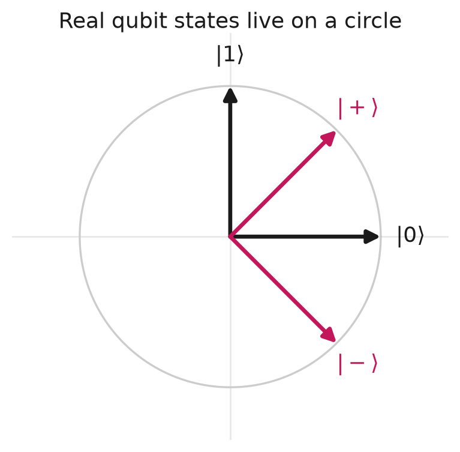
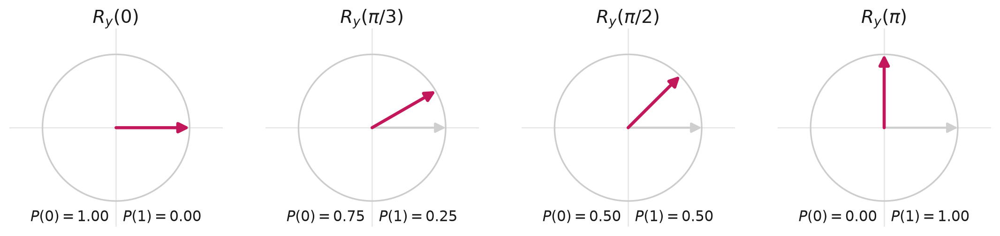
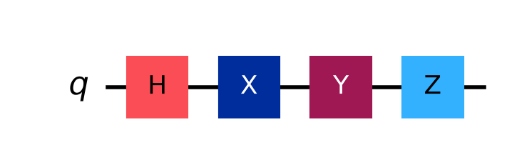
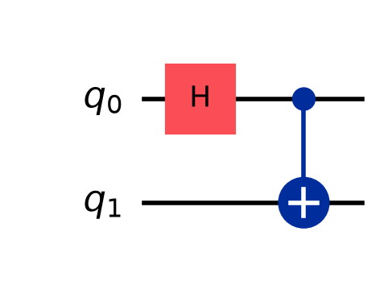
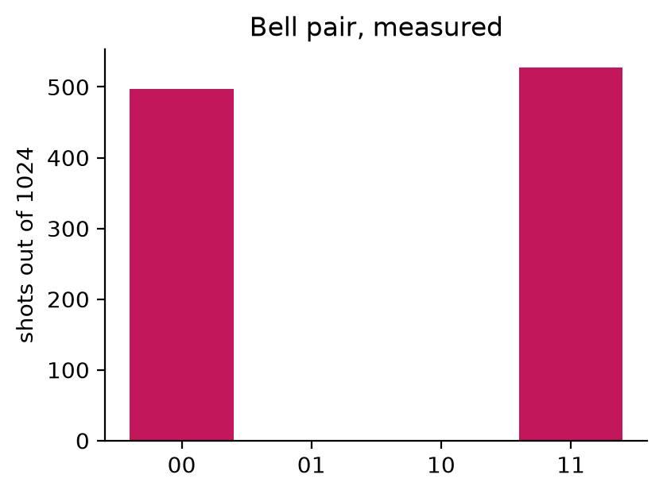
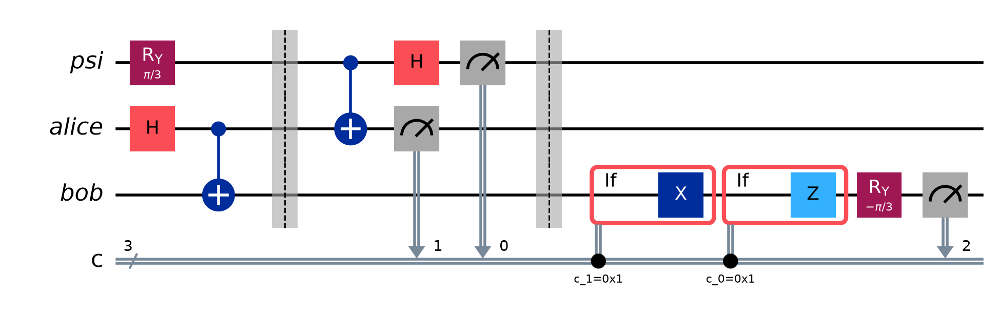

<!-- _class: lead -->

# Quantum Computing Fundamentals

From kets to key distribution

Alessandro Gentili Perez

<span class="small">Based on *Quantum Computing for Everyone* (Bernhardt), implemented in Qiskit</span>

---

## Everything here is 2D, and real

A qubit is a vector of length 1. With **real** amplitudes, every state sits on the
unit circle. **Kets** are column vectors; **bras** are their transpose.

$$|0\rangle = \begin{bmatrix}1\cr0\end{bmatrix} \qquad |1\rangle = \begin{bmatrix}0\cr1\end{bmatrix} \qquad \langle 0| = \begin{bmatrix}1 & 0\end{bmatrix}$$



<span class="small">Complex amplitudes would fill a sphere instead. Not needed until the quantum Fourier transform.</span>

---

## A qubit, and why the squares sum to 1

$$|v\rangle = c_0|0\rangle + c_1|1\rangle \qquad c_0^2 + c_1^2 = 1$$

$c_0$ and $c_1$ are **probability amplitudes**. Measuring gives

$$P(0) = c_0^2 \qquad P(1) = c_1^2$$

so the normalisation condition is just "the probabilities add to 1".

**Standard basis** — $\{|0\rangle, |1\rangle\}$ — is orthonormal:

$$\langle 0|0\rangle = 1 \qquad \langle 1|1\rangle = 1 \qquad \langle 0|1\rangle = 0$$

<span class="small">A bra times a ket gives a number: the overlap between two states.</span>

---

## Rotations move you around the circle

$R_y(\theta)$ rotates by $\theta/2$. Angles are in **radians**.

$$R_y(\theta)|0\rangle = \cos\tfrac{\theta}{2}|0\rangle + \sin\tfrac{\theta}{2}|1\rangle$$



<span class="small">`qc.ry(math.pi/3, 0)` — note $R_y(\pi/2)$ lands on $|+\rangle$, the same place a Hadamard does.</span>

---

## Two qubits: the tensor product

Alice has $|v\rangle = c_0|a_0\rangle + c_1|a_1\rangle$, Bob has $|w\rangle = d_0|b_0\rangle + d_1|b_1\rangle$.

$$|v\rangle \otimes |w\rangle = c_0d_0|a_0b_0\rangle + c_0d_1|a_0b_1\rangle + c_1d_0|a_1b_0\rangle + c_1d_1|a_1b_1\rangle$$

Name the four amplitudes:

$$r = c_0d_0 \qquad s = c_0d_1 \qquad t = c_1d_0 \qquad u = c_1d_1$$

It is still normalised, because

$$\underbrace{(c_0^2 + c_1^2)}_{1}\underbrace{(d_0^2 + d_1^2)}_{1} = r^2 + s^2 + t^2 + u^2 = 1$$

---

## The entanglement test

If the state really came from a tensor product, then

$$ru = c_0d_0 \cdot c_1d_1 = c_0c_1d_0d_1 \qquad st = c_0d_1 \cdot c_1d_0 = c_0c_1d_0d_1$$

They must be equal. So:

$$\boxed{\begin{aligned} ru = st &\Rightarrow \textbf{separable} \cr ru \neq st &\Rightarrow \textbf{entangled}\end{aligned}}$$

Separable means each qubit has a state of its own. Entangled means only the
**pair** has a state.

<span class="small">Equivalently: $ru - st$ is the determinant of $\begin{bmatrix}r & s\cr t & u\end{bmatrix}$, so separable = determinant zero.</span>

---

## Example A — not entangled

Alice $\left(\tfrac{1}{\sqrt2}, \tfrac{1}{\sqrt2}\right)$, Bob $\left(\tfrac12, \tfrac{\sqrt3}{2}\right)$. Tensor them:

$$r = \tfrac{1}{2\sqrt2} \quad s = \tfrac{\sqrt3}{2\sqrt2} \quad t = \tfrac{1}{2\sqrt2} \quad u = \tfrac{\sqrt3}{2\sqrt2}$$

**Test:** $ru = \tfrac{\sqrt3}{8}$ and $st = \tfrac{\sqrt3}{8}$. Equal → separable.

**Group by Alice's kets:**

$$|a_0\rangle\left(\tfrac{1}{2\sqrt2}|b_0\rangle + \tfrac{\sqrt3}{2\sqrt2}|b_1\rangle\right) + |a_1\rangle\left(\tfrac{1}{2\sqrt2}|b_0\rangle + \tfrac{\sqrt3}{2\sqrt2}|b_1\rangle\right)$$

**Normalise each bracket** — both have norm $\sqrt{\tfrac18 + \tfrac38} = \tfrac{1}{\sqrt2}$ — and Bob's part is a **common factor**:

$$= \left(\tfrac{1}{\sqrt2}|a_0\rangle + \tfrac{1}{\sqrt2}|a_1\rangle\right)\left(\tfrac12|b_0\rangle + \tfrac{\sqrt3}{2}|b_1\rangle\right)$$

---

## Example B — entangled

$$r = \tfrac12 \qquad s = \tfrac12 \qquad t = \tfrac{1}{\sqrt2} \qquad u = 0$$

**Test:** $ru = 0$ but $st = \tfrac{1}{2\sqrt2}$. Different → entangled.

**Group by Alice's kets and normalise the same way:**

$$\tfrac{1}{\sqrt2}|a_0\rangle\left(\tfrac{1}{\sqrt2}|b_0\rangle + \tfrac{1}{\sqrt2}|b_1\rangle\right) + \tfrac{1}{\sqrt2}|a_1\rangle|b_0\rangle$$

Bob's two brackets are now **different**, so nothing factors out. Neither qubit
has a state of its own.

**What that means:** Alice measures $|a_0\rangle$ or $|a_1\rangle$ with equal odds — but
her result decides Bob's. Get $|a_1\rangle$ and Bob is $|b_0\rangle$ with certainty.

---

## Single-qubit gates

$$I = \begin{bmatrix}1&0\cr0&1\end{bmatrix} \quad X = \begin{bmatrix}0&1\cr1&0\end{bmatrix} \quad Y = \begin{bmatrix}0&1\cr-1&0\end{bmatrix} \quad Z = \begin{bmatrix}1&0\cr0&-1\end{bmatrix} \quad H = \tfrac{1}{\sqrt2}\begin{bmatrix}1&1\cr1&-1\end{bmatrix}$$

<div class="cols">

```python
qc.h(0)   # superposition
qc.x(0)   # NOT: |0> <-> |1>
qc.z(0)   # flips the sign of |1>
qc.y(0)   # both at once
```



</div>

$X$ is NOT. $Z$ changes the **relative phase** without changing any probability.
$H$ puts a basis state into superposition: $H|0\rangle = \tfrac{1}{\sqrt2}(|0\rangle + |1\rangle)$.

<span class="small">$Y$ here is the real-valued version; the true Pauli $Y$ carries a factor $-i$, and only that one squares to $I$.</span>

---

## CNOT, and making entanglement

A single-qubit gate can **never** entangle. You need a two-qubit gate.

<div class="cols">



```python
qc = QuantumCircuit(2)
qc.h(0)        # superposition
qc.cx(0, 1)    # entangle
```

</div>

$$|00\rangle \xrightarrow{H} \tfrac{1}{\sqrt2}(|00\rangle + |10\rangle) \xrightarrow{CNOT} \tfrac{1}{\sqrt2}(|00\rangle + |11\rangle)$$

Test it: $r = u = \tfrac{1}{\sqrt2}$, $s = t = 0$, so $ru = \tfrac12 \neq 0 = st$. **Entangled.**

---

## And it shows up in the measurements

<div class="cols">



Only `00` and `11`. Never `01` or `10`.

The two qubits always agree — but neither had a value before measurement.

This **Bell pair** is the resource every protocol below is built on.

</div>

---

## Superdense coding

Send **2 classical bits** by physically transmitting **1 qubit**.


Alice and Bob share $\tfrac{1}{\sqrt2}(|00\rangle + |11\rangle)$. Alice applies one gate to
**her qubit only**, sends it, and Bob undoes the Bell circuit.

| bits | 00 | 01 | 10 | 11 |
|:--|:-:|:-:|:-:|:-:|
| Alice applies | $I$ | $X$ | $Z$ | $ZX$ |

---

## Superdense coding — why it works

$$|00\rangle \xrightarrow{H} \tfrac{1}{\sqrt2}(|00\rangle + |10\rangle) \xrightarrow{CNOT} \tfrac{1}{\sqrt2}(|00\rangle + |11\rangle)$$

Alice applies $X$ to send `01`:

$$\xrightarrow{X} \tfrac{1}{\sqrt2}(|10\rangle + |01\rangle)$$

Bob reverses the Bell circuit:

$$\xrightarrow{CNOT} \tfrac{1}{\sqrt2}(|11\rangle + |01\rangle) \xrightarrow{H} |01\rangle$$

```python
qc.h(0); qc.cx(0, 1)      # Bell pair, shared in advance
qc.x(0)                   # Alice encodes "01" on her qubit alone
qc.cx(0, 1); qc.h(0)      # Bob decodes
```

<span class="small">The four gates map the pair onto four distinguishable Bell states. Entanglement is what lets one qubit carry two bits.</span>

---

## Quantum teleportation

Move **1 qubit's state** using **2 classical bits**. The exact opposite trade.



Alice entangles her unknown state with her half of the pair, measures both, and
sends the two bits. Bob applies a correction.

| Bob receives | 00 | 01 | 10 | 11 |
|:--|:-:|:-:|:-:|:-:|
| Bob applies | $I$ | $X$ | $Z$ | $Y$ |

---

## Teleportation — the catch

The state is **not copied** — no-cloning forbids that. Alice's measurement
destroys her copy at the moment Bob's appears.

Nothing travels faster than light either: without the 2 classical bits, Bob's
qubit is useless. Each of his four possible states is equally likely.

```python
qc.ry(theta, psi)              # the state to send
qc.h(a); qc.cx(a, b)           # shared Bell pair
qc.cx(psi, a); qc.h(psi)       # Alice: reverse Bell circuit
qc.measure(psi, c[0]); qc.measure(a, c[1])
with qc.if_test((c[1], 1)): qc.x(b)    # Bob corrects
with qc.if_test((c[0], 1)): qc.z(b)
```

<span class="small">Verified in `teleportation.py`: $|0\rangle$, $|1\rangle$, $|+\rangle$ and $R_y(\pi/3)|0\rangle$ all arrive in 100% of shots.</span>

---

## BB84 — detecting an eavesdropper

Not encryption. It produces a shared random key **and tells you if anyone looked**.

Two **conjugate** bases: $Z = \lbrace|0\rangle, |1\rangle\rbrace$ and $X = \lbrace|+\rangle, |-\rangle\rbrace$. Measuring in
the wrong one gives a **coin flip** and destroys the state.


<span class="small">A clean round: Alice sends $|-\rangle$, Bob happens to pick $X$ too, and reads her bit with certainty. One qubit per round — no entanglement anywhere.</span>

---

## BB84 — what Eve costs


Eve cannot copy the qubit (**no-cloning**), so she must measure — and guess a basis.

She is wrong half the time, and then Bob errs half of *those*:

$$\text{QBER} = \tfrac12 \times \tfrac12 = 25\text{\%}$$

Alice and Bob sacrifice some bits, compare them openly, and abort above **11%**.

<span class="small">Her gain: 75% of the key. Useless, because the key is discarded.</span>

---

## E91 — the same job, via Bell's theorem

<div class="cols">


A source emits entangled pairs. Each side measures along a randomly chosen axis.

$$E(\theta_a, \theta_b) = \cos(\theta_a - \theta_b)$$

</div>

Combine four settings into the **CHSH** sum $S$. Any theory where the bits existed
before measurement obeys $|S| \le 2$. Quantum mechanics reaches $2\sqrt2 \approx 2.83$.

Eve has to entangle herself with the pair to learn anything — and **monogamy of
entanglement** means that halves every correlation, dropping $S$ to $1.41$.

<span class="small">Measured: $S = 2.78 \pm 0.07$ clean, $1.34$ with Eve. The eavesdropper is visible as a *failed violation*.</span>

---

<!-- _class: lead -->

## Recap

| | sends | adversary | needs entanglement |
|:--|:--|:-:|:-:|
| Superdense coding | 2 bits via 1 qubit | no | yes |
| Teleportation | 1 qubit via 2 bits | no | yes |
| BB84 | a secret key | **yes** | no |
| E91 | a secret key | **yes** | yes |

All four run locally or on IBM hardware with `--ibm`.

<span class="small">github.com/alessandrogpz/quantum-computing-notes</span>
